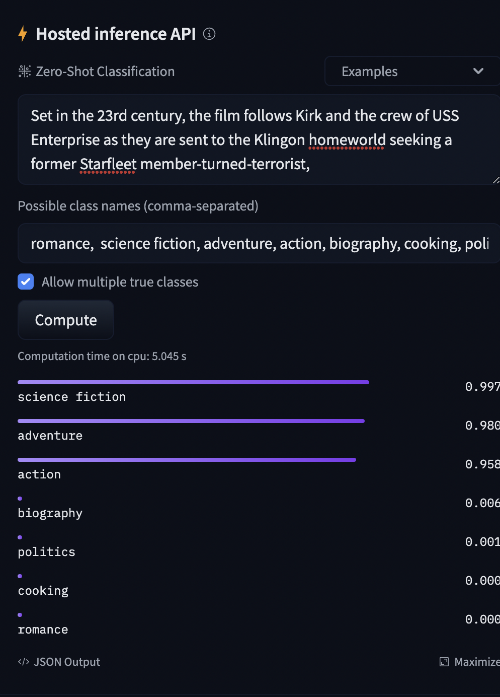

## Data scientist at 42 Matters Interview Task

This repo contains the work performecd for the interviewing process at 42 Matters.

It is divided into 3 folders each ones answering 3 questions.

The list of the tasks to be achieved can be found [here](docs/Data_Scientist_42matters_Interview_Tasks__2022b_.pdf).


## Installation

This process was tested on mac and linux (Ubuntu 20.04).

To prepare this work, please instantiate the docker container with the following command in your terminal (with Docker installed). The following command will download the dataset and instantiate the docker container.


``` make ```


## Task 1: Movie Categorization

The task at hand consists to classify movies into genres. Regarding the kind of data that we do possess, we have 2 textual fields that we can use, the film name as well as the decritption of the movie.

Additionnaly, we also posess the poster of the movie.

### Approach:

My approach, as each time in a data-based situation would be to work in iteration. Currently, it seems much easier to usethe textual data at hand to match the textual data of each classes. Hence, during the first step of this work, we will discard the poster.


## First steps:
The steps will be the following ones:
- For the category names, the description as well as the film title, perform the following steps:
    - Remove the special characters (and convert to UTF if possible)
    - Lemmatization of the text
    - Lowercase the text
    - Remove the movieswhere no description and/or title was provided

- Do a simple word detection of the categorie's names in the title and the description. This woudl at least lead to some kind of classification on a limited subset of the data.

- To extend this step, select a subset of the categories and assign a "bag of words" to each of them. Then, rerun the simple word detection on the titles and description.

At the end of this step, we will have a subset ofthe dataset "annotated" by this technique.

Pros:
 - Fast and easy to implement
 - Trustworthy approach - having the word science fiction in the description makes the predicted categories more trustworthy.
 - Easy to extend with a bag of words principle
 - Adding a movie does not cause any problem with this technique
 - Can handle several category label at the same time
 - Each time a category is added, the process is not impacted

Cons:
 - Not really extendable with manycategories (here with a thousand of them)
 - Can be easily biased by the interpretation of the operator that created the bag of words ( I may think spaceship and you may think aliens first and foremost for example).
 - No understanding of the underlying data.

## Refinement with NLP models

Thanks to the recent advencements in deep learning, we can now use NLP models to perform the classification. Witht he processed text, we could used some pre-trained models such as BERT, RoBERTa, XLNet, XLM, DistilBERT, GPT-2, etc.

Some of these models are trained at zero-shot learning, meaning that they do not think in fixed categories. Instead, the embed the categories in thedataset andperform a similarity analysis between the input sentence (encoded as a vector in the feature space of the model) and the categories (also encoded in the feature space of the model).

The results obtained from this approach add the sentence understanding to the classification and can thus refine our guesses. For exemple such as in the exemple below with a [BERT model](https://huggingface.co/facebook/bart-large-mnli) using the description of [StarTrek into Darkness](https://www.imdb.com/title/tt1408101/?ref_=nv_sr_srsg_0) (A movie that I can wholeheartedly recommend).



Pros:
 - Using the provided models,we can classify the categories of the movie with a possibly great level of accuracy.
 - The model can be easily extended with new categories.
 - Using new films does not influence the output of the model.

Cons:
- Slow and compute intensive (it takes here 5s on cpu to accomplish this task). With some tunning and a parallelization of the tasks on gpu, we can speed up the process at the expense of the compute cost (and maybe of the dedicated hardware/server processing cost).
- The models are incredibly complex and the misclassification will be hard to understand.
- The Training data of such models can induce a bias (which will be probably more negligeable than a bag of word)


## Final refinement (and possible extension) - Usage of the poster

We assume that in this case, we used the previous approaches but only with a subset of our datas. We now have a fairly accurate dataset with seemingly trustworthy labels. Nonetheless, due to the compute time and the price of the previous bert technique, only a subset of the dataset was annotated. Plus, we never got to use the poster. Plus, we want to make this implementation our own.

One way to to this would be to create our own classification model (with a fixed or non-fixed number of categories). For this, we could use a lightweight language model to encode the sentence and the title. Additionnaly, we can use a fairly simple CNN to encode the poster (for exemple a [VGG-16](https://arxiv.org/abs/1409.1556) model).

Then, with the concatinated encoded vector, we can perform a similarity analysis between the input sentence and the categories. Using a fixed number of categories, we can perform a fairly simple classification model using neural networks or tree based techniques. Trying to implement a model that can handlen a zero-shot classification might require a lot of expertise and time (Plus the inference time will be longer).

Pros:
 - We can use the previous source of truth to make our own model.
 - If only an encoding step and a classification step are required, the inference time of the model (once optimised) should be much faster than the precedent approach.
- The model also uses the poster that can contain some underlying information.
- The model is extendable with more entries

Cons:
- Require some ML expertise to implement the model.
- The model is not really extendable with many categories (If we go with the non zero-shot approach).
- Computationaly expensive nonetheless depending of the architecture of the model.


Of course, at each of these thress steps, we should review the prediction of the model and also practice some manual annotations of some obviously misaligned data. If some users are later on exposed to the predictions of the model, proposing some simple feedback options could also be a great way to provide an human-based and "free" annotation of the data.

Finaly, one approach that was not considered in this study but that could be cheaper and also yielda seamingly high accuracy would be to employ some labelers to manually annotate the data. As this test was more of a demonstration of my technical knowledge, I prefered to omit it. Nonetheless, it could be a trustworthy (and cheap depending on the contractor) way to get some accurate annotation. This would of course imply that the data must be shared with an external comppany, which is not often possible.

## Task 2: Word Count in Pyspark

The work performedvia spark is available in the python file : [2-wordCount.py](src/2-wordCount.py).

To run the code, please run the following code in the terminal:

``` make wordCount```

Here we are just using the docker container as our python distribution to run the code.

## Task 3: Movies view estimations in Python


This Task is divided in two implementations:

- If you are only interested by the end result of the analysis, you can run the following code in the terminal:

``` make moviesView ```

This will generate the csv file [moviesViewEstimations.csv](output/moviesViewEstimations.csv) that contains the estimated number of views for each movie.

- If you are interested in the process of the analysis, you can run the following code in the terminal:

``` make notebook ```

This should create a jupyter notebook server that you can open in your browser at the following address : [http://localhost:8890](http://localhost:8890)

From there, select the file [movieViewEstimation.ipynb]() and run it (Or use this simple [link](http://localhost:8890/notebooks/notebooks/3-movieViewEstimation.ipynb) and paste it in your browset to access it directly).

## Cleaning

To clean the original and generated data as well as the docker image generated during this exercise, please run the following command in the terminal:

``` make clean```